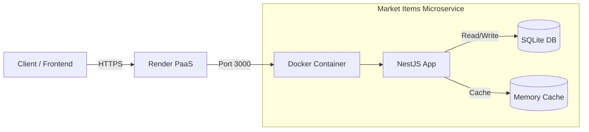
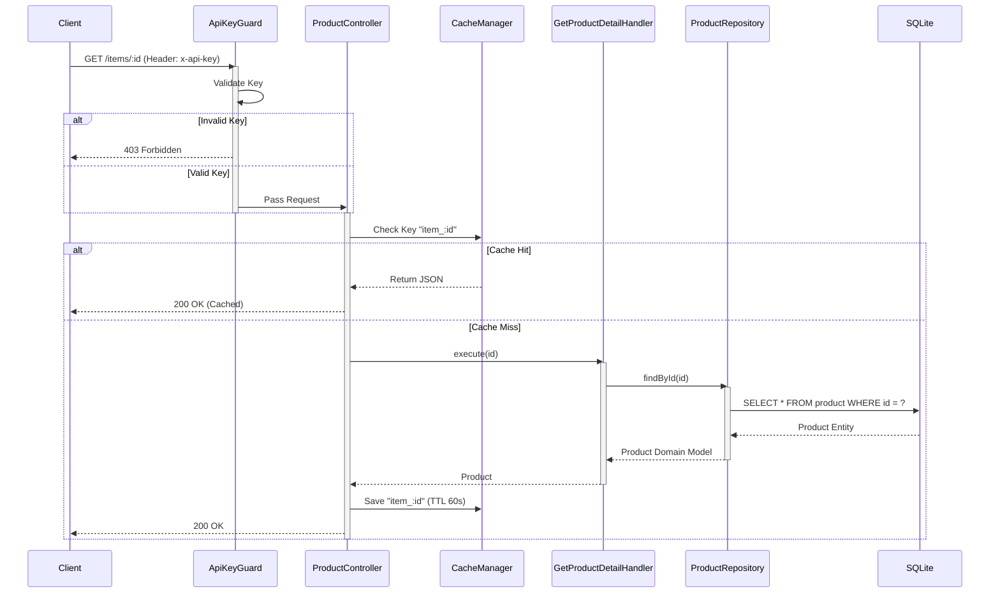

# Market Items API

Backend API for serving product details, built with **NestJS** following **Hexagonal Architecture** principles.

### Badges

[](https://dl.circleci.com/status-badge/redirect/gh/c0dejohn/market-items-challenge/tree/main)
[](https://sonarcloud.io/summary/new_code?id=c0dejohn_market-items-challenge)


## 🚀 Features

*   **Hexagonal Architecture**: Strict separation between Domain, Application, and Infrastructure layers.
*   **Repository Pattern**: Data persistence is decoupled from business logic. Currently using a **File-Based Adapter** (`items.json`) to simulate a database.
*   **High Quality Standards**:
    *   **>90% Test Coverage** (Unit & Integration).
    *   **SOLID** Principles applied (Dependency Inversion, Single Responsibility).
    *   **Conventional Commits** enforced.

## 📂 Project Structure

```
src/
├── products/
│   ├── domain/                         # Pure Business Logic (Enterprise Rules)
│   │   ├── product.model.ts            # Domain Entity
│   │   └── product.repository.interface.ts # Port (Secondary Port)
│   ├── application/                    # Application Business Rules
│   │   └── get-product-detail.handler.ts # Use Case Implementation
│   └── infrastructure/                 # Adapters & External Details
│       ├── http/
│       │   └── product.controller.ts   # Primary Adapter (REST API)
│       └── persistence/
│           ├── entities/               # ORM Entities
│           └── sqlite-product.repository.ts # Secondary Adapter (Database)
├── common/                             # Shared utilities, filters, guards
└── app.module.ts                       # Main Module Composition
```

## 🛠️ Setup & Installation

1.  Navigate to the project directory:
    ```bash
    cd market-items
    ```
2.  Install dependencies:
    ```bash
    npm install
    ```
3.  Run the application:
    ```bash
    # Development
    npm run start:dev

    # Production
    npm run start:prod
    ```

## ✅ Testing

This project maintains a high coverage threshold (>=80%).

```bash
# Unit & Integration Tests
npm run test

# Coverage Report
npm run test:cov
```

## Swagger

The interactive API documentation is available at:
- **Local**: `http://localhost:3000/api`
- **Production**: `https://market-items-challenge.onrender.com/api`

## 💻 Technology Stack

*   **Core Framework**: [NestJS](https://nestjs.com/) (Node.js v22+) - Selected for its modularity and first-class TypeScript support.
*   **Language**: TypeScript - Explicit typing for domain modeling.
*   **Architecture**: Octagonal / Hexagonal (Ports & Adapters).
*   **Persistence**:
    *   **SQLite** (via TypeORM): In-memory/file relational database for robust testing.
    *   **JSON Seeding**: Automatic data population on startup.
*   **Caching**: `cache-manager` (In-memory) for high-performance repetitious reads.
*   **Security**:
    *   `Helmet`: Secure HTTP headers.
    *   `API Key Guard`: Custom authentication strategy.
    *   `Class-Validator`: Strict Request/Response validation.
*   **DevOps & Infrastructure**:
    *   **Docker**: Multi-stage build (Dev/Prod) based on Alpine.
    *   **CircleCI**: Automated Testing & Deployment Pipeline.
    *   **Render**: Cloud PaaS for auto-deployment via Webhooks.
    *   **SonarCloud**: Static Code Analysis & Quality Gates.

## 🏗️ Architecture & Topology

### System Topology

The system operates as a self-contained Microservice for the **Product Catalog Domain**.



### Request Sequence (GET /items/:id)

The flow follows the **CQRS-like** query path optimized for read performance:



## 🔄 DevOps Flow: CI/CD & Quality Assurance

This project uses an automated pipeline to ensure every delivery meets production standards:

*   **Continuous Integration (CircleCI)**: Every push triggers an isolated environment where dependencies are installed and unit/integration tests are executed.
*   **Static Analysis (SonarCloud)**: Code undergoes security (SAST), quality, and coverage analysis. The Quality Gate blocks the flow if vulnerabilities are detected or if coverage drops below 80%.
*   **Continuous Deployment (Render)**: Upon passing CI metrics, a webhook triggers a zero-downtime deployment to Render.

## 🤖 AI Collaboration

This project was built using an **Agentic Workflow** assisting the developer, following a **Spec-Driven Development** approach.

*   **Methodology**: The developer explicitly defined the Architectural Style (Hexagonal), Quality Standards, Features, and Documentation requirements upfront. The AI acted as an accelerator to implement these precise specifications, ensuring human-led design with machine-assisted execution.
*   **AI Assistants Used**: Google Gemini (via Antigravity).
*   **Role**:
    *   **Code Generation**: Scaffolding NestJS framework based on Hexagonal Specs.
    *   **Refactoring**: Migrating persistence layers while respecting Domain boundaries.
    *   **Documentation**: Translating architectural concepts into Mermaid Diagrams and ADRs.
    *   **Debugging**: Log analysis for CI/CD pipelines.

## 🏗️ Architecture Decisions (ADR)

See [docs/adr](docs/adr) for detailed records:
*   [ADR-001](docs/adr/001-hexagonal-architecture.md): Adoption of Hexagonal Architecture.
*   [ADR-002](docs/adr/002-file-persistence-strategy.md): File-Based Persistence Strategy (Superseded by SQLite).
*   [ADR-003](docs/adr/003-item-detail-scope.md): Item Scope & Data Aggregation.
